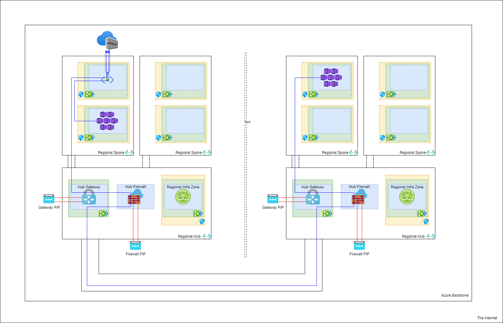

# Walgreens Health Network Space.

* [Back to Table of Contents](README.md)

The Walgreens Health network topology is broken into two isolated networks, separate from each-other and from the WBA network.

This is by design to create a layer of separation between production an non-production data that is extremely difficult to transcend, and
to provide a means for reusing address space in the virtual private network model between them.

It otherwise in each area follows a multi-region hub and spoke topology not too different from the WBA Azure network layout

The following diagram shows the path of travel to a common resource across regions to illustrate how traffic flows when connected as part
of the same overall network.

#### Multi-region Hub & Spoke

In the typical model at WBA, this same picture could be used to represent a production and non-production pair and how traffic would flow.

## VPN / Remote Access

#### Client Profiles
* [wh-np-vpn-client.xml](./vpn/wh-np-vpn-client.xml)
* [wh-p-vpn-client.xml](./vpn/wh-p-vpn-client.xml)

> To run Azure VPN client on your WBA device you need to request it be added to your software center library through a DWP ticket

Because both production and non-production networks in Walgreens Health are both separate from each-other, and separate from WBA you cannot
leverage our pre-existing VPN solution for reaching the private network of either of them.

In reality, there are several endpoints that are commonly hit that are actually external, so if you were to look at a real network map
you would see things crossing in and out of the private network. Most of the public facing components are restricted either directly
based on origin, or indirectly based on origin by the identity provider.

One of the most regular and common interaction points is the Azure DevOps web interface / API which is a public SaaS. Because all of the development
happens in a non-production capacity the Azure DevOps organization is linked to the non-production identity provider, and the non-production identity
provider is configured to allow origins from both the non-production Walgreens Health exit points, and the WBA exit points meaning you can access it
from WBA VPN, WBA remote desktop, and the Walgreens Health specific VPN (which egresses through the Walgreens Health exit points).

To access the private network of Walgreens Health you need to connect to that network independently.

To simplify the management overhead of maintaining multiple VPN solutions the choice was made to use [Azure VPN P2S](https://docs.microsoft.com/en-us/azure/vpn-gateway/point-to-site-about). 
Being an integrated part of the hub network gateway there is no additional infrastructure necessary to maintain, and the gateway is a highly available service by default supported by Microsoft.

## Authentication Flow

### Non-Production

### Production

## Network Space Allocations

Since we are leveraging a common routing domain within each Walgreens Health segment (production & non-production), 
we have to manage the allocation of address space to not cause overlap and conflicts.

Since the Walgreens Health application is the primary consumer of this network, the majority of the address space is
pre-allocated to it by default unless otherwise noted. This will act as a table of `/16` segments and their overall intended purpose.

Micro segmentation will be represented in the environment specific documents which should be referenced in the main readme.

> For segments outside of our direct control, information is rough designations, and may not be accurate or up to date.

| Address Space | Designation                   |
|---------------|-------------------------------|
| 10.0.0.0/16   | Infrastructure Services       |
| 10.1.0.0/16   | Walgreens Health Provisioning |
| 10.2.0.0/16   | Walgreens Health (Unknown)    |
| -----------   | --------------------------    |
| 10.254.0.0/16 | Walgreens Health (Unknown)    |
| 10.255.0.0/16 | DataLynx & Data Science       |

> we are not listing out all `/16`'s and will add to it as they are allocated
